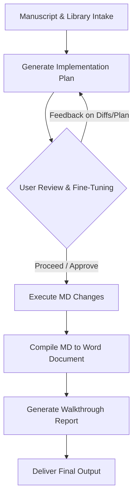

# Frontiers Review Paper Skill (peer-review-cross-ref v2)

Structured workflow for peer-reviewing academic manuscripts submitted to *Frontiers in Aging Neuroscience* using a local literature library and the Antigravity pair-programming loop.

## 1. Folder & System Structure

To execute this skill, set up the following environment:
- **Literature Folder**: `E:\Frontiers_Aging_Neuroscience_Review_Lit\`
  - Contains categorized PDF papers (e.g., `01_Peak_Alpha_Frequency_PAF_IAPF`, `02_Spectral_Power_Distribution`, `03_Aperiodic_1f_Component`, etc.).
  - Contains `Analysis_Report.md` (cross-referencing local literature and manuscript claims) and `INDEX.md`.
- **Working Review Folder**: `D:\Frontiers in Aging Neuroscience Paper review\`
  - Contains the target manuscript (`1878469_Manuscript.PDF`), the draft comments (`Reviewer_Comments_2026-06-10.md`), and the compilation script (`build_docx_v2.py`).
  - Compiled output should be stored as `Reviewer_Comments_2026-06-17.docx` (or matching the current review date).

---

## 2. Antigravity Pair-Programming Loop

To ensure precision and quality, the review must follow this loop before making any final changes to the reviewer report:



1. **Implementation Plan (`implementation_plan.md`)**:
   - Outline the proposed changes, major/minor comments, and citations.
   - List any open questions or design dilemmas for the user to review.
   - **Gating**: Stop and wait for the user's explicit approval before proceeding.
2. **Execution & Compilation**:
   - Perform precise file edits in Markdown.
   - Run the python script (`build_docx_v2.py`) to compile the Markdown file into a Word Document.
3. **Walkthrough (`walkthrough.md`)**:
   - Provide a detailed summary of all adjustments, verification results, and paths of the compiled outputs.
   - Highlight how diff comments from the user were integrated.

---

## 3. Scientific Review Guidelines

### 3.1. Delta/Theta Trajectories: Normal Aging vs. AD Slowing
Conflating physiological and pathological aging trajectories is a major error in aging neuroscience reviews. Ground the Major Comments in this distinction:
- **Healthy Physiological Aging**: 
  - absolute delta and theta power **do not increase** (they stay flat or decrease).
  - The dominant posterior rhythm remains in the **alpha range** (though peak alpha frequency PAF slows).
  - *Voytek et al. (2015)* shows that in healthy aging, slow wave power (delta/theta) decrements while fast wave power (beta) increments.
- **Pathological Aging (MCI/AD Continuum)**:
  - absolute delta and theta power **significantly and progressively increase** ("EEG slowing").
  - The dominant rhythm shifts out of the alpha range entirely into the theta or delta range.
- **Mechanistic Cascade**:
  - Cholinergic basal forebrain degeneration (partially reversed/stabilized by AChEIs/memantine; e.g., Babiloni et al., 2013) $\rightarrow$ neuronal E/I imbalance (Maestu et al., 2021) $\rightarrow$ cortical network disruption and hypersynchronization (Lopez et al., 2014) $\rightarrow$ slow wave (delta/theta) power increase (Babiloni et al., 2021).
- **Brain-Age Model Impact**: Models must be sensitive to the *direction* of absolute delta/theta changes to avoid misclassifying healthy older adults as pathological or vice versa.

### 3.2. Aperiodic (1/f) Exponent Controversy in AD
- **Terminology**: 
  - **Steeper Slope** = more negative log-log slope (e.g., $-1.0 \rightarrow -1.5$) = **increased exponent (exponent ↑)**.
  - **Flatter Slope** = less negative log-log slope (e.g., $-1.5 \rightarrow -1.0$) = **decreased exponent (exponent ↓)**.
- **Three AD Stances**:
  1. *Stance A (Steeper / Exponent ↑)*: Represented by **Chu et al. (2023, *Frontiers in Aging Neuroscience*, fnagi-15-1195424)**. Shows exponent increases from CN (~1.0) to severe AD (~1.5) under strict age-correction (ANCOVA). Represents compensatory **inhibitory dominance** (Gao et al., 2017) or network hyperexcitability downregulation (Stam, 2023; Maestu et al., 2021).
  2. *Stance B (Flatter / Exponent ↓)*: Consistent with the accelerated aging hypothesis (Voytek et al., 2015; Finley et al., 2023). Exponent decrease over 10 years predicts cognitive decline.
  3. *Stance C (No difference)*: Represented by **Kopcanova et al. (2024, *Neurobiology of Disease*)**. Argues AD electrophysiological changes are purely periodic (oscillatory) once modeled.
- **Donoghue (2024) Systematic Review**:
  - Detailed citation: *Donoghue et al. (2024, A systematic review of aperiodic neural activity in clinical investigations)*.
  - Clinical statistics: Analyzed 143 papers (35 diseases). Exponent changes: 35% increase (steeper), 31% decrease (flatter), 30% no difference.
  - **Alzheimer's specific (9 reports)**: classified as **inconsistent (8 reporting increase/steeper, 3 reporting decrease/flatter, with region-specific differences)**.
  - Discrepancies arise from:
    1. *FOOOF/specparam settings*: only 56% report fitting details, 30% report $R^2$.
    2. *Frequency fitting ranges*: ranges vary (1–43 Hz vs. 3–30 Hz), altering the estimated exponent.
    3. *Cohort severity*: inclusion of severe cases (Chu et al. 2023) vs. mild-to-moderate (Kopcanova et al. 2024).
    4. *Age correction strategies*: age matching vs. treating age as a covariate vs. ANCOVA.

### 3.3. Machine Learning Framework Taxonomy
In Section 3.2 (Machine Learning Frameworks), enforce a strict distinction between:
- **Traditional Machine Learning (Manual Feature Engineering + ML)**: Al Zoubi et al. (2018), James & Burgess (2025). Features (PSD, complexity) are manually extracted and fed into ML algorithms.
- **End-to-End Deep Learning (Raw EEG to CNN/RNN)**: Jusseaume & Valova (2022), Khayretdinova et al. (2022). Raw signals are directly mapped to age, operating as a "black box."
- **Study Protocols vs. Completed Studies**: Ensure study proposals/protocols (like **Hembara & Vakorin, 2023**) are *never* mixed with completed empirical studies. Ensure Hembara & Vakorin (2023)'s citation is checked, as it merely reviews/cites Al Zoubi (2018)'s results (MAE 6.9, $R^2 = 0.37$) and does not present new empirical results.

### 3.4. ERP Component Rework
- Because resting-state brain-age prediction pipelines rely strictly on resting spectral and complexity indices, they do not incorporate Event-Related Potentials (ERPs).
- Condense long cataloging of ERPs (like N100, N170, P300) or move them to a separate discussion, explicitly explaining that task-based cognitive markers of aging are distinct from resting-state brain-age indices.

### 3.5. Reference Audit Checklist
Verify that the manuscript's bibliography does not contain errors:
- **Attribution**: Ref 29 should be Gemein, L. et al. (2024).
- **Non-existent papers**: Ref 50 does not exist and should be removed.
- **Cross-references**: Ref 73 is a duplicate of Ref 61 (Kounios et al., 2024). Ref 74 should cite Banville et al. (2024) instead of a commercial blog.
- **Journals**: Ref 86 is published in the *Journal of Neuroscience* (not *eLife*).
- **Inconsistent Formatting**: Correct capitalization inconsistency in Ref 33 (De Blasio) and Ref 35 (de Lange).
- **Broken links**: Repair dead links in Refs 48, 57, 86.
- **Formatting style**: The bibliography must be strictly formatted in **APA style**.

---

## 4. Review Template Formatting Rules

- **Remove redundant subtitles**: Ensure that sub-headers like `**Why it matters:**` are removed from the Major Comments to make the report concise and professional. Integrate the context directly under the `Issue` or as a continuing paragraph.
- Use the following format for each Major Comment:
  ```markdown
  ### Major X — [Descriptive Title]

  - **Issue:** [Specify manuscript location, line numbers, and the problem. Ground it with primary literature or external citation.]
    [Context of why it matters, integrated as a paragraph without a separate sub-header.]
  - **Suggested resolution:** [Concrete, actionable steps for the authors to resolve the issue.]
  ```
- Minor Comments should follow a page/line or figure/table number mapping.
